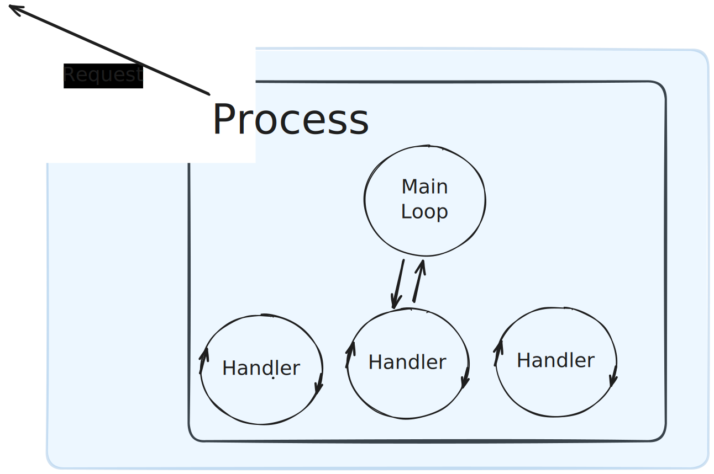

# Concurrency in Ruby: From `fork()` to Fiber

---

<style scoped>
img {
  width: 500px;
}
</style>


---


---

<style scoped>
img {
  width: 1100px;
}
</style>


---

```diff
workers:
  - queues: [critical]
-    threads: 3
+    threads: 5
    processes: 1
  - queues: ["default", "low"]
    threads: 3
    processes: 1
```

---

```diff
workers:
  - queues: [critical]
-    threads: 5
+    threads: 10
    processes: 1
  - queues: ["default", "low"]
    threads: 3
    processes: 1
```

---

```diff
workers:
  - queues: [critical]
-    threads: 10
+    threads: 20
    processes: 1
  - queues: ["default", "low"]
    threads: 3
    processes: 1
```

---

<style scoped>
img {
  width: 500px;
}
</style>


---

## Stay Tuned and Find Out

---

## About Me

- Yuri Bocharov
- U.S. Citizenship and Immigration Services (USCIS)
- Platform / Infrastructure

---

## Talk Overview

- What is concurrency
- Three main concurrency primitives
- How concurrency primitives are used
- Why that config didn't work as expected.

---

## Web Server

---

```rb
require 'socket'

class Server
  def initialize(port:)
    @server = TCPServer.new(port)
  end

  def start
    loop do
      connection = @server.accept
      handle(connection)
      connection.close
    end
  end

  def handle
    # ...
  end
end

server = Server.new(port: 3000)
server.start
```

---

```rb
@server = TCPServer.new(port)
```

---

```rb
loop do
  connection = @server.accept
  handle(connection)
  connection.close
end
```

---

## Handling a Connection

```rb
def handle(connection)
  data, = connection.recv_nonblock(BUFFER_SIZE)
  return if data.nil?

  sleep 0.05
  response_payload = fibonacci(4000)

  <<~RESP
    HTTP/1.1 200 OK
    Content-Type: text/plain

    Response: #{response_payload}
  RESP
rescue IO::WaitReadable
  retry
end
```

---

```rb
data, = connection.recv_nonblock(BUFFER_SIZE)
```

---

```rb
sleep 0.05
```

---

```rb
response_payload = fibonacci(4000)
```

---

```rb
<<~RESP
  HTTP/1.1 200 OK
  Content-Type: text/plain

  Response: #{response_payload}
RESP
```

---

```rb
server = Server.new(port: 3000)
server.start
```

---

<style scoped>
img {
  width: 1100px;
}
</style>


---

## Performance

|                     | Serial Server | Preforking | Threadpool | Prefork + Threadpool | Fiber | Prefork + Fiber |
| ------------------- | ------------- | ---------- | ---------- | -------------------- | ----- | --------------- |
| Requests per Second | 17.3          | ?          | ?          | ?                    | ?     | ?               |

---

## Concurrency

---

## What is Concurrency?

Concurrency is **dealing** with more than one task at a time.

---

## Cooking

---


---


---


---

## What is Parallelism?

---

Parallelism is taking more than one **action** at a time.

---


---


---


---

## Parallelism Requires Hardware

---

### Recap: Concurrency vs Parallelism

> "Concurrency is about **dealing with** lots of things at once. Parallelism is about **doing** lots of things at once." - Rob Pike

---

## 3 Concurrency Primitives

- **Process** (`Process`)
- **Thread** (`Thread`)
- **Coroutine** (`Fiber`)

---

## Process

OS Construct that runs a program.

---

```console
$ > ps aux
USER               PID  %CPU %MEM      VSZ    RSS   TT  STAT STARTED      TIME COMMAND
yuri              7984  15.4  4.9 422528096 816336   ??  S     5:09PM   0:16.76 /Applications/Firefox.app/Contents
yuri             95161  12.6  1.7 413454080 287968   ??  S    11:54AM   3:31.54 /Applications/Firefox.app/Contents
yuri             75448  11.1  1.3 1865978544 210464   ??  S    11:57PM  28:51.86 /Applications/Google Chrome.app/Co
yuri              1363   6.9  0.4 413137872  72832   ??  S    26Aug25  35:21.03 /Applications/Ghostty.app/Contents
```

---

```console
$ > ps aux | rg ruby
yuri             34952   0.0  0.0 412642304   2912   ??  Ss   Tue02PM   0:03.12 /Users/yuri/.local/share/mise/installs/ruby/3.4.5/bin/ruby-lsp
yuri              8516   0.0  0.0 410065616    224 s013  S+    5:36PM   0:00.00 rg ruby
```

---

## Ruby Process

```rb
fork do
  # do stuff
end
```

---

## Processes Can Parallelize Work

```rb
2.times do
  fork do
    generate_pdf
  end
end
```

---

```console
$ > ps aux | rg ruby
yuri             34952   0.0  0.0 412642304   2912   ??  Ss   Tue02PM   0:03.12 /Users/yuri/.local/share/mise/installs/ruby/3.4.5/bin/ruby-lsp
yuri              8599   0.0  0.0 410065616    224 s013  R+    5:37PM   0:00.00 rg ruby
yuri              8588   0.0  0.0 411326560   2368 s025  S+    5:37PM   0:00.00 ruby pdf_generation.rb
yuri              8587   0.0  0.0 411317344   2352 s025  S+    5:37PM   0:00.00 ruby pdf_generation.rb
yuri              8586   0.0  0.1 411317600  13088 s025  S+    5:37PM   0:00.05 ruby pdf_generation.rb
```

---


---

## How do we use this?

---

<style scoped>
img {
  width: 1100px;
}
</style>


---

<style scoped>
img {
  width: 1100px;
}
</style>


---

<style scoped>
img {
  width: 1100px;
}
</style>


---

```rb
fork do
  handle(connection)
  connection.close
end
```

---

```rb
def start
  loop do
    connection = @server.accept

    pid = fork do
      handle(connection)
    ensure
      connection.close
    end

    connection.close
    Process.detach(pid)
  end
end
```

---

## Is it good?

---


---

<style scoped>
img {
  width: 400px;
}
</style>

## Process Internals


---

<style scoped>
img {
  width: 600px;
}
</style>


---


---

## Don't Forget the Hardware Requirement

---


---


---


---

<style scoped>
img {
  width: 1000px;
}
</style>


---

## Preforking Server

```rb
def start
  PROCESS_COUNT.times do
    fork do
      loop do
        connection = @server.accept
        handler.handle(connection)
        connection.close
      end
    end
  end
end
```

---

## Impact

|                     | Serial Server | Preforking | Threadpool | Prefork + Threadpool | Fiber | Prefork + Fiber |
| ------------------- | ------------- | ---------- | ---------- | -------------------- | ----- | --------------- |
| Requests per Second | 17.3          | 448.81     | ?          | ?                    | ?     | ?               |

---

## Real World

- Unicorn
- Pitchfork

---

## Summary: Processes

- Allow True Parallelism
- One Process Per CPU Core

---

## Threads

---

<style scoped>
img {
  width: 1000px;
}
</style>


---

<style scoped>
img {
  width: 1000px;
}
</style>


---

<style scoped>
img {
  width: 1000px;
}
</style>


---

<style scoped>
img {
  width: 1000px;
}
</style>


---

```rb
Thread.new do
  # do_work
end
```

---

```rb
time = Benchmark.realtime do
  sleep 2
  sleep 2
  sleep 2
end
puts "Serial sleep took #{time} seconds"
# => Serial sleep took 6.012791999964975 seconds
```

---

```rb
time = Benchmark.realtime do
  threads = []
  threads << Thread.new { sleep 2 }
  threads << Thread.new { sleep 2 }
  threads << Thread.new { sleep 2 }
  threads.each(&:join)
end
puts "Parallel sleep took #{time} seconds"
```

---

```rb
time = Benchmark.realtime do
  threads = []
  threads << Thread.new { sleep 2 }
  threads << Thread.new { sleep 2 }
  threads << Thread.new { sleep 2 }
  threads.each(&:join)
end
puts "Parallel sleep took #{time} seconds"
# => Parallel sleep took 2.004996999981813 seconds
```

---

## So why even use `Process`?

---

```rb
time = Benchmark.realtime do
  fibonacci 300_000
  fibonacci 300_000
  fibonacci 300_000
end
puts "Serial fibonacci took #{time} seconds"
# => Serial fibonacci took 3.3579959999769926 seconds
```

---

```rb
time = Benchmark.realtime do
  threads = []
  threads << Thread.new { fibonacci 300_000 }
  threads << Thread.new { fibonacci 300_000 }
  threads << Thread.new { fibonacci 300_000 }
  threads.each(&:join)
end
puts "Parallel fibonacci took #{time} seconds"
```

---

```rb
time = Benchmark.realtime do
  threads = []
  threads << Thread.new { fibonacci 300_000 }
  threads << Thread.new { fibonacci 300_000 }
  threads << Thread.new { fibonacci 300_000 }
  threads.each(&:join)
end
puts "Parallel fibonacci took #{time} seconds"
#=> Parallel fibonacci took 3.330549000063911 seconds
```

---

## Global VM Lock (GVL)

---

<style scoped>
img {
  width: 400px;
}
</style>


---

<style scoped>
img {
  width: 1000px;
}
</style>


---

<style scoped>
img {
  width: 1000px;
}
</style>


---

<style scoped>
img {
  width: 1000px;
}
</style>


---

<style scoped>
img {
  width: 1000px;
}
</style>


---

<style scoped>
img {
  width: 1000px;
}
</style>


---

<style scoped>
img {
  width: 1000px;
}
</style>


---

## What does this mean?

---

- More threads != more better
- Amount of threads you need depends

---

### Server Model: The Thread Pool

---

<style scoped>
img {
  width: 1000px;
}
</style>



---

```rb
def start
  loop do
    connection = @server.accept

    @thread_pool.add_task(connection) do |conn|
      @handler.handle(conn)
      connection.close
    end
  end
end
```

---

```rb
class ThreadPool
  def run
    # ...
    Thread.new do
      until @queue.closed? && @queue.empty?
        task, value = @queue.pop
        task&.call(value)
      end
    end
  end
end
```

---

## Impact

|                     | Serial Server | Preforking | Threadpool | Prefork + Threadpool | Fiber | Prefork + Fiber |
| ------------------- | ------------- | ---------- | ---------- | -------------------- | ----- | --------------- |
| Requests per Second | 17.3          | 448.21     | 173.88     | ?                    | ?     | ?               |

---

### Server Model: Prefork + Threads

---

<style scoped>
img {
  width: 1000px;
}
</style>


---

<style scoped>
img {
  width: 1100px;
}
</style>


---

```rb
def start
  PROCESS_COUNT.times do
    fork do
      THREAD_COUNT.times do
        Thread.new do
          loop do
            connection = @server.accept
            handler.handle(connection)
            connection.close
          end
        end
      end
    end
  end
end
```

---

## Impact

|                     | Serial Server | Preforking | Threadpool | Prefork + Threadpool | Fiber | Prefork + Fiber |
| ------------------- | ------------- | ---------- | ---------- | -------------------- | ----- | --------------- |
| Requests per Second | 17.3          | 448.81     | 173.88     | 880.5                | ?     | ?               |

---

## Puma

---


---


---

## Threads Recap

- Threads are light weight and can share memory
- Ruby code (when using CRuby) runs concurrently with threads
- IO / Kernel level code runs in parallel

---

## Coroutine (`Fiber`)

---

<style scoped>
img {
  width: 500px;
}
</style>


---

<style scoped>
img {
  width: 500px;
}
</style>


---

```rb
Fiber.new do
  # do_stuff
end
```

---

## Fibers are cooperative

---

## Threads are preemptive

---


---

<style scoped>
img {
  width: 1000px;
}
</style>


---

<style scoped>
img {
  width: 1000px;
}
</style>


---

<style scoped>
img {
  width: 1000px;
}
</style>


---

## Fiber are cooperative

---


---

```rb
Fiber.new do
  # do stuff
  Fiber.yield some_value
  # do more stuff
end
```

---

## So What?

---

<style scoped>
img {
  width: 1000px;
}
</style>


---

<style scoped>
img {
  width: 1000px;
}
</style>


---

## Drawbacks?

- Bad actors
- Incompatibility of some gems

---

## Final Stats?

|                     | Serial Server | Preforking | Threadpool | Prefork + Threadpool | Fiber  | Prefork + Fiber |
| ------------------- | ------------- | ---------- | ---------- | -------------------- | ------ | --------------- |
| Requests per Second | 17.3          | 448.21     | 173.88     | 880.5                | 526.27 | 2074.8          |

---


---

## Recap: Fibers

- cooperative not preemptive
- cheap AF

---

## So, About That Config

---

```yaml
workers:
  - queues: [critical]
    threads: 20
    processes: 1
```

---

<style scoped>
img {
  width: 1000px;
}
</style>


---

## Conclusion: Know Your Tools

- **Process:** Great for safety and CPU-bound parallelism.
- **Thread:** Great for I/O-bound work (database calls, APIs).
- **Fiber:** Best for massive I/O concurrency.

---

## Meta Conclusion

Dig deeper.

---

## Thank You

Questions?

---

# Outtakes?

## OS level versus Application level

---

<style scoped>
img {
  width: 600px;
}
</style>


---


---


